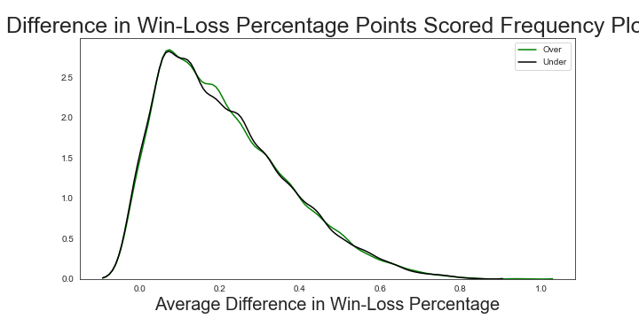

# Taking on the House: NFL Over/Under Predictor

- **Overview**

On May 14, 2018, the United States Supreme Court issued a highly anticipated decision that struck down the federal ban on state authorization of sports betting.  This decision opens the door to states that wish to allow betting on sporting events, a process that all of the states in the tristate area have already begun. Since the landmark Supreme Court decision to legalize sports gambling the sports gambling industry has continued to grow exponentially. With a lot of states still making plans to legalize, this is the perfect time to make a mark on the growing industry. 

- **Business Problem**

This project is tasked with the goal to successfully predict the Over/Under total of a NFL game. In the United States, betting on the Over/Under in NFL games is one of the most popular forms of betting. My business goal is to be able to help the everyday bettor make more informed decisions. While organization like the MLB have fully embraced the transformation to using data-driven ideas, the NFL is still very much in its infancy stage. I believe that there is still an opportunity to pick up on certain data insights that the bettor could take into account when placing a bet. 

  
- **Data:** 

My first task was to source the data. For the original dataset I used https://www.kaggle.com/tobycrabtree/nfl-scores-and-betting-data, the dataset consisted of "National Football League (NFL) game results since 1966 with betting odds information since 1979. Dataset was created from a variety of sources including games and scores from a variety of public websites such as ESPN, NFL.com, and Pro Football Reference. Weather information is from NOAA data with NFLweather.com a good cross reference. Betting data was used from http://www.repole.com/sun4cast/data.html for 1978-2013 seasons. Pro-football-reference.com data was then cross referenced for betting lines and odds as well as weather data. From 2013 on betting data reflects lines available at sportsline.com. The first was a dataset that had all the betting data for every NFL game played dating back to the 1960s. Then I also managed to retrieve an NFL Stadium dataframe, which had all the relevant NFL Stadiums dating back to the 1960s." Next, I decided it was important to use data containing some of the team statistics for each home and away team, www.pro-football-reference.com turned out to be an amazing source for all the NFL statistics I needed. Then last I was able to use the Dark Sky Rapid API to pull all the weather data relating to each individual NFL game in the dataset. The final dataframe consists of 9815 observation and 73 features. To get a better sense of the data I categorized all 73 features into a simple 4 categories; Setting, Team Statistics, Weather, and Betting Data. 

- **EDA:** 

Once I had collected all the relevant data, I started with EDA of each of the four categories. 

Setting EDA

The Setting group contained all features that portray the time or place an NFL game was taking place. Day of the Week a game was played on was one of the first features I looked in to. Below is a visualization describing the Over/Under comparison for each day of the week. 

It is important to note that the class imbalance would lead to favor the Under, so it would be notable that Saturday games Overs seem to eclipse Under in percentage. It is also important to note Friday only has a sample size of 10, so while interesting, data is insufficient to gain insights. 

Another feature explored from the 'Setting" group was Stadium Capacity. Below is a violin plot showing the distribution of Stadium Capacity throughout the dataset.

This shows that while most Stadiums lay in the size range of 60,000 to 80,000 maximum capacity, there are some outliers. I chose to explore that realization by binning the stadium capacity into three separate groups; Low, Medium, and High

We can see here that the percentage of Overs eclipses Under in Low Capacity Stadiums, and in High Capacity Stadiums the Under percentage take a sizeable percentage, giving insight into the possibility playing in High Capacity Stadiums could lead to more Under. We can further analyze this by looking at the total amount of points scored at different size stadiums.

While it is very slight, the point totals do seem to decrease in higher capacity stadiums. These are the types of insights we can use to help the everyday bettor make more informed decisions. While this information is not necessarily game changing on its own, this could be good information for a bettor to make a more informed decision.

Betting EDA

Next I wanted to look at some of the other pre-game betting data to better understand what can lead to an Over/Under. First, I looked at the spread. The spread is a number predicted by the handicapper, that he/she thinks the winning team is going to win by. 
We can see in the plot below that as that number gets bigger the percentages start to become more volatile. 

While there isn't exactly a noticeable pattern determining over/under, and bettor could use this information with other insights to make a more informed decision. For example, if the spread is a very big number and they are playing at a high capacity stadium, the smart bet could be to assume the Under. 

Team Statistics EDA

While pulling data from Pro-Football-Reference the original dataset inherited a lot of football statistical terms, none too difficult to understand. The major one I focused on during EDA was Win-Loss Percentage. Below are three charts showing the frequency of Home Win-Loss Percentage, Away, and the difference between the Home and Away team. It also shows the following the Over or Under for each category.

While these patterns don't look like much, we can see a brief period of time (around .5 to .7 Away Team Win-Loss Percentage) & (around .2 Difference in Win-Loss Percentage) where Over exlipses Under. When doing further analysis when both the conditions are meet there is an almost 9% better chance of an Over outcome, considering the class imbalance. This coukld be another potential area that a bettor could look out for when decided on the Over/Under.

Weather EDA

Last, I looked into the weather conditions during when the game was played. Similar to the other features, we can use weather features to determine when a bettor should bet in a certain direction. Our number one goal is to give the everyday bettor guidence to hopefully making the right decision. Weather plays a big on the Over/Under outcome, more so than others Wind Speed is a very good indicator. Below I have a visual that shows the Over/Under outcome percentages as the wind gets more extreme. We can see that as the wind gets heavier there is a great chance of the Under.  

Below we can gather more evidence that shows heavier winds is usually equal to lower points. This is another example of a great insight to consider when making an Over/Under bet. 

